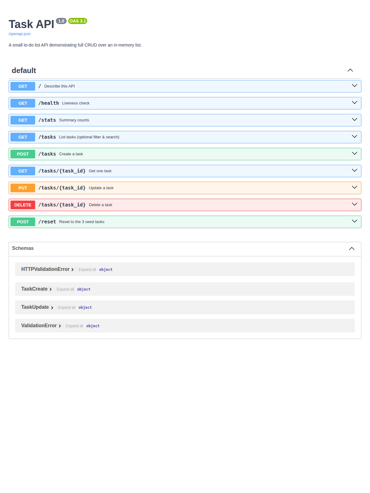

# Task API — W2 · A2 (SQLite Database)

A tiny **to-do list API** demonstrating full **CRUD** (Create, Read, Update, Delete)
over a **SQLite database**, built with **FastAPI**. Swagger UI is included for free
at `/docs`.

Tasks are stored in a SQLite file (`tasks.db`) so data **survives server restarts**.

## Install & run

```bash
python3 -m venv venv
source venv/bin/activate
pip install -r requirements.txt
uvicorn app:app --reload
```

The server starts on **http://localhost:8000**.
Open **http://localhost:8000/docs** for interactive Swagger UI.

On first run the `tasks.db` file is created automatically and seeded with 3 example tasks.

## Endpoints

| Method | Path            | CRUD   | Success | Errors                          | Meaning                          |
|--------|-----------------|--------|---------|---------------------------------|----------------------------------|
| GET    | `/`             | —      | 200     | —                               | Describe the API                 |
| GET    | `/health`       | —      | 200     | —                               | Liveness check                   |
| GET    | `/tasks`        | Read   | 200     | —                               | List all tasks                   |
| GET    | `/tasks/{id}`   | Read   | 200     | 404 unknown id                  | Get one task                     |
| POST   | `/tasks`        | Create | 201     | 400 empty/missing title         | Create a task                    |
| PUT    | `/tasks/{id}`   | Update | 200     | 400 empty/invalid body, 404 id  | Update title and/or done         |
| DELETE | `/tasks/{id}`   | Delete | 204     | 404 unknown id                  | Remove a task                    |

Every error returns a JSON body of the shape `{ "error": "..." }`.

### Extras

| Method | Path                         | Meaning                                              |
|--------|------------------------------|------------------------------------------------------|
| GET    | `/tasks?done=true`           | Filter by completion state (SQL WHERE)               |
| GET    | `/tasks?search=milk`         | Keep tasks whose title contains the word (SQL LIKE)  |
| GET    | `/tasks?sort=asc`            | Sort alphabetically by title (SQL ORDER BY)          |
| GET    | `/stats`                     | `{ "total": 3, "done": 1, "open": 2 }` (SQL COUNT)  |
| POST   | `/reset`                     | Restore the 3 original seed tasks                    |

### Task fields

| Field        | Type    | Description                        |
|--------------|---------|------------------------------------|
| `id`         | integer | Auto-increment primary key         |
| `title`      | text    | Task description                   |
| `done`       | boolean | Completion status                  |
| `created_at` | text    | ISO-8601 UTC timestamp             |
| `updated_at` | text    | ISO-8601 UTC timestamp             |

## Example: `curl -i`

```bash
$ curl -i -X POST http://localhost:8000/tasks \
       -H "Content-Type: application/json" \
       -d '{"title":"Buy milk"}'

HTTP/1.1 201 Created
date: Mon, 20 Jul 2026 17:44:49 GMT
server: uvicorn
content-type: application/json

{"id":4,"title":"Buy milk","done":false,"created_at":"2026-07-20T17:44:49+00:00","updated_at":"2026-07-20T17:44:49+00:00"}
```

## Swagger UI



Use **Try it out** on any endpoint to run the full CRUD cycle without curl.

## The persistence experiment

Create a few tasks, restart the server, then `GET /tasks`. **Your tasks are still there!**
That's because they live in `tasks.db` on disk, not just in memory. Try the same with
the old in-memory version and your new tasks vanish — that's the whole point.

## SQLite — why?

- **Zero setup**: SQLite is a single file (`tasks.db`), no server process needed.
- **Built into Python**: the `sqlite3` module is part of the standard library.
- **Perfect for learning**: the same SQL you learn here works on PostgreSQL, MySQL, etc.
- **Portable**: copy `tasks.db` to another machine and it just works.

## SQL queries explored

These were run manually in **DB Browser for SQLite**:

```sql
-- List every task
SELECT * FROM tasks;

-- Show only completed tasks
SELECT * FROM tasks WHERE done = 1;

-- Count all tasks
SELECT COUNT(*) FROM tasks;

-- Mark every task as completed
UPDATE tasks SET done = 1;

-- Delete all completed tasks
DELETE FROM tasks WHERE done = 1;
```

After running each query, the API immediately reflected the changes.

## Architecture

```
Client → API → SQLite Database (tasks.db)
```

The client doesn't know the difference. `GET /tasks` still returns tasks.
`POST /tasks` still creates tasks. The only difference is that data persists
on disk.

## AI vs me

*(carried over from Part 1)*

**My prompt** (written from memory, not copied from the assignment):

> Build a to-do list REST API in Python with FastAPI, storing tasks in an in-memory
> list (no database). Each task has an integer `id`, a string `title`, and a boolean
> `done`. Seed it with 3 example tasks. Implement five endpoints: `GET /tasks` (list
> all), `GET /tasks/{id}` (one task, 404 if missing), `POST /tasks` (create from a JSON
> body with just a title, assign the next id, done=false, return 201), `PUT /tasks/{id}`
> (update title and/or done, 404 if missing), and `DELETE /tasks/{id}` (remove, return
> 204). Validate input: a missing or empty title must return 400. Use the built-in
> Swagger UI at `/docs`.

The AI's code lives in [`ai-version/main.py`](ai-version/main.py), untouched, so my
hand-built `app.py` stays hand-built. I ran it on port 8001 and fired my Stage 4
checkpoint curls at it. Three concrete differences:

1. **Wrong status code for a missing body.** `POST /tasks` with `{}` returned **422**,
   not the **400** my prompt asked for.

2. **A validation rule it quietly dropped.** `POST /tasks` with `{"title":"   "}`
   (whitespace only) returned **201** and happily created a blank task.

3. **Different error shape + a silent decision on PUT.** The AI returns
   `{"detail": "..."}` (FastAPI's `HTTPException` default), while mine returns
   `{"error": "..."}`.

**What my prompt forgot to specify:** the exact JSON error shape, whether whitespace-only
titles count as empty, and what an empty PUT body should do.

> The lesson: the AI's output was exactly as good as my specification.
