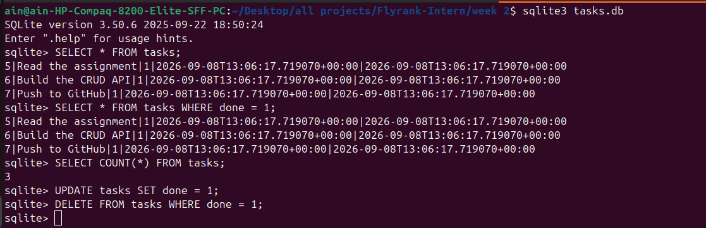

# Task API — W3 · A1 (Docker + SQLite + Repository Pattern)

A tiny **to-do list API** demonstrating full **CRUD** with **Docker**, **SQLite**, and a
clean **repository pattern** — built with **FastAPI**. Data persists across container
restarts via a Docker volume.

## Architecture

```
Client → API (app.py) → Repository (repository.py) → SQLite (tasks.db)
```

**Key insight**: `app.py` contains only routes. All database logic lives in
`repository.py`. To swap SQLite for PostgreSQL later, you change **one file** —
the routes and API contract stay identical.

## Quick start

### Option A — Docker (recommended)

```bash
docker compose up --build
```

The API starts at **http://localhost:8000**.
Swagger UI at **http://localhost:8000/docs**.

### Option B — Local

```bash
python3 -m venv venv
source venv/bin/activate
pip install -r requirements.txt
DB_PATH=tasks.db uvicorn app:app --reload
```

## Environment variables

| Variable  | Default      | Description                    |
|-----------|--------------|--------------------------------|
| `DB_PATH` | `tasks.db`   | Path to the SQLite database    |

The `.env` file sets `DB_PATH=/data/tasks.db` for Docker.
A committed `.env.example` shows the required variables.

## Endpoints

| Method | Path            | CRUD   | Success | Errors                          | Meaning                          |
|--------|-----------------|--------|---------|---------------------------------|----------------------------------|
| GET    | `/`             | —      | 200     | —                               | Describe the API                 |
| GET    | `/health`       | —      | 200     | —                               | Liveness check                   |
| GET    | `/tasks`        | Read   | 200     | —                               | List all tasks                   |
| GET    | `/tasks/{id}`   | Read   | 200     | 404 unknown id                  | Get one task                     |
| POST   | `/tasks`        | Create | 201     | 400 empty/missing title         | Create a task                    |
| PUT    | `/tasks/{id}`   | Update | 200     | 400 empty/invalid body, 404 id  | Update title and/or done         |
| DELETE | `/tasks/{id}`   | Delete | 204     | 404 unknown id                  | Remove a task                    |

### Extras

| Method | Path                    | Meaning                                        |
|--------|-------------------------|------------------------------------------------|
| GET    | `/tasks?done=true`      | Filter by completion state                     |
| GET    | `/tasks?search=milk`    | Keep tasks whose title contains the word       |
| GET    | `/tasks?sort=asc`       | Sort alphabetically by title                   |
| GET    | `/stats`                | `{ "total": 3, "done": 1, "open": 2 }`         |
| POST   | `/reset`                | Restore the 3 original seed tasks              |

## Repository pattern — what changed

The routes in `app.py` did not change. Only the storage implementation swapped:

| Before (A2)                | After (A3)                          |
|----------------------------|-------------------------------------|
| SQL calls in every route   | `repo.get_all()`, `repo.create()`, etc. |
| `DB_PATH = "tasks.db"`     | `DB_PATH` from `.env`               |
| No Docker                  | `docker compose up` runs everything |

This separation proves the assignment's core lesson:

> *"Switch storage = change one file. The API stays the same."*

## Docker — how it works

```
docker compose up
    └── app container
         ├── /app/tasks.db  ← Docker volume (persists on host)
         └── reads DB_PATH from .env
```

- **Volume**: `task-data:/data` keeps `tasks.db` alive when the container stops.
- **`.env`**: sets `DB_PATH=/data/tasks.db` inside the container.
- **`.env.example`**: committed template so others know what variables are needed.

## Persistence proof

```
1. docker compose up --build
2. POST /tasks {"title":"Docker persistence test"}  → 201
3. GET /tasks  → 4 tasks (including the new one)
4. docker compose down
5. docker compose up -d
6. GET /tasks  → 4 tasks (data survived!) ✓
```

## SQL schema

```sql
-- init.sql
CREATE TABLE IF NOT EXISTS tasks (
    id         INTEGER PRIMARY KEY AUTOINCREMENT,
    title      TEXT    NOT NULL,
    done       BOOLEAN NOT NULL DEFAULT 0,
    created_at TEXT    NOT NULL,
    updated_at TEXT    NOT NULL
);
```

## SQL queries explored

```sql
SELECT * FROM tasks;
SELECT * FROM tasks WHERE done = 1;
SELECT COUNT(*) FROM tasks;
UPDATE tasks SET done = 1;
DELETE FROM tasks WHERE done = 1;
```

### Screenshot — SQL queries in sqlite3



## Swagger UI


## Files

| File                | Purpose                                    |
|---------------------|--------------------------------------------|
| `app.py`            | Routes only — calls repository methods     |
| `repository.py`     | All SQLite logic — the swappable layer     |
| `Dockerfile`        | Python 3.12-slim image                     |
| `docker-compose.yml`| Runs app with volume for persistence       |
| `init.sql`          | Table creation SQL                         |
| `.env`              | DB_PATH for Docker (gitignored)            |
| `.env.example`      | Committed template                         |
| `requirements.txt`  | Python dependencies                        |

## AI vs me

*(carried over from Part 1)*

**My prompt** (written from memory, not copied from the assignment):

> Build a to-do list REST API in Python with FastAPI, storing tasks in an in-memory
> list (no database). Each task has an integer `id`, a string `title`, and a boolean
> `done`. Seed it with 3 example tasks. Implement five endpoints: `GET /tasks` (list
> all), `GET /tasks/{id}` (one task, 404 if missing), `POST /tasks` (create from a JSON
> body with just a title, assign the next id, done=false, return 201), `PUT /tasks/{id}`
> (update title and/or done, 404 if missing), and `DELETE /tasks/{id}` (remove, return
> 204). Validate input: a missing or empty title must return 400. Use the built-in
> Swagger UI at `/docs`.

The AI's code lives in [`ai-version/main.py`](ai-version/main.py), untouched, so my
hand-built `app.py` stays hand-built. Three concrete differences:

1. **Wrong status code for a missing body.** 422 instead of 400.
2. **A validation rule it quietly dropped.** Whitespace-only titles accepted.
3. **Different error shape + a silent decision on PUT.** `{"detail": "..."}` vs `{"error": "..."}`.

> The lesson: the AI's output was exactly as good as my specification.
